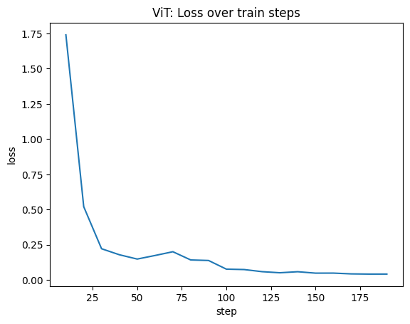

# TDT05 Project 2023
#### Tommy D. Luu & Kristian B. Sylte
This project classifies the mnist dataset. It uses a fine-tuned classification model with feature extractors from microsoft ResNet-152 and google ViT, both pretrained on ImageNet 1k. ResNet is pretrained on a classification task. ViT is trained with a image masking task.

- Models: [ViT](https://huggingface.co/google/vit-base-patch16-224), [ResNet](https://huggingface.co/microsoft/resnet-152)
- Dataset: [Mnist](https://huggingface.co/datasets/mnist/)
- Fine-tuned ViT/ResNet classification model: [Download here](https://drive.google.com/drive/folders/1VV4nW6UGPaTQdoGKZB3q2z1BRYF582hc?usp=drive_link)

## Related Papers

- [ResNet](https://arxiv.org/abs/1512.03385)
- [ViT](https://arxiv.org/abs/2010.11929)

## Configuration

### Dataset split
Using only train dataset from mnist (60k images)
- Train: 1% of dataset (600 images)
- Test: 1% of dataset (600 images)
- Validation: 98% of dataset  (58800 images)

### Finetuning Google ViT Classifier
- Number of parameters: 85M
- Batch size: 32
- Learning rate (LR): 2e-4
- Epochs: 10

### Finetuning ResNet-152 Classifier
- Number of parameters: 60M
- Batch size: 16 (Because of CUDA memory constraints)
- Learning rate (LR): 0.001
- Epochs: 10

## Results

- Here are the evaluation results in JSON format:

```json
[
  {
    "vit_model_epoch10_eval": {
      "accuracy_overall": 0.9798
    }
  },
  {
    "resnet_model_epoch10_eval": {
      "accuracy_overall": 0.9637
    }
  }
]
```
- Training loss




## Observations
- Shows better performance for the SSL model versus the non-SSL model
- ResNet needs more training time to have a significant test accuracy.
```json
  {
        "model": "resnet152",
        "epoch": 2.63,
        "eval_accuracy": 0.8166666666666667,
        "eval_loss": 0.5859881043434143,
        "eval_runtime": 4.0951,
        "eval_samples_per_second": 146.516,
        "eval_steps_per_second": 18.314,
        "step": 100
      },
      {
      "model": "vit",
      "epoch": 2.63,
      "eval_accuracy": 0.9816666666666667,
      "eval_loss": 0.1686812788248062,
      "eval_runtime": 3.3574,
      "eval_samples_per_second": 178.71,
      "eval_steps_per_second": 22.339,
      "step": 50
  },
```
- ResNet trained for 5 epochs reached an accuracy of ~0.5 on validation set
- ViT trained for 5 epochs reached an accuracy >0.9 on validation set

